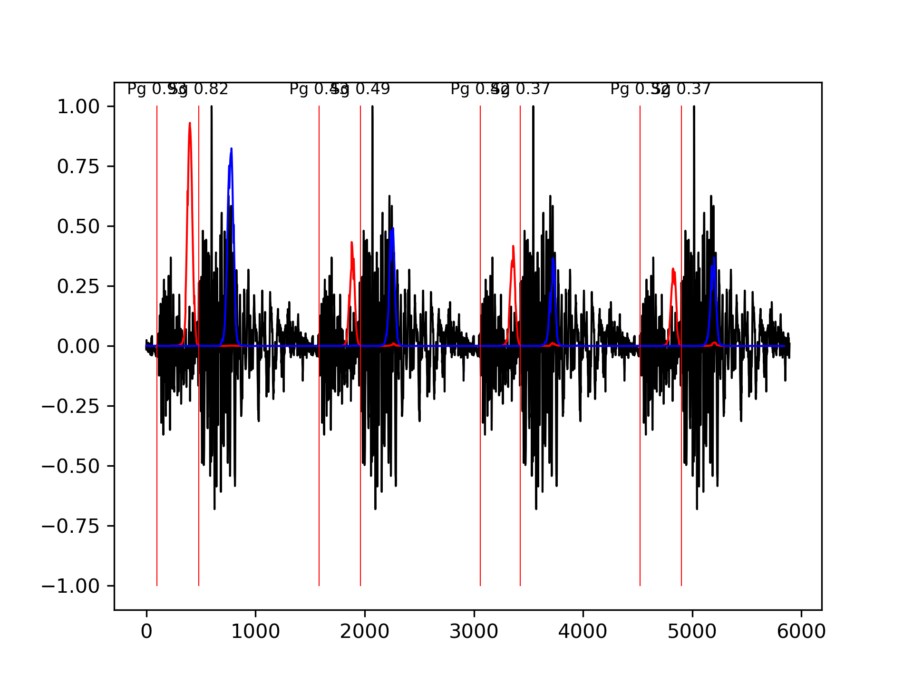
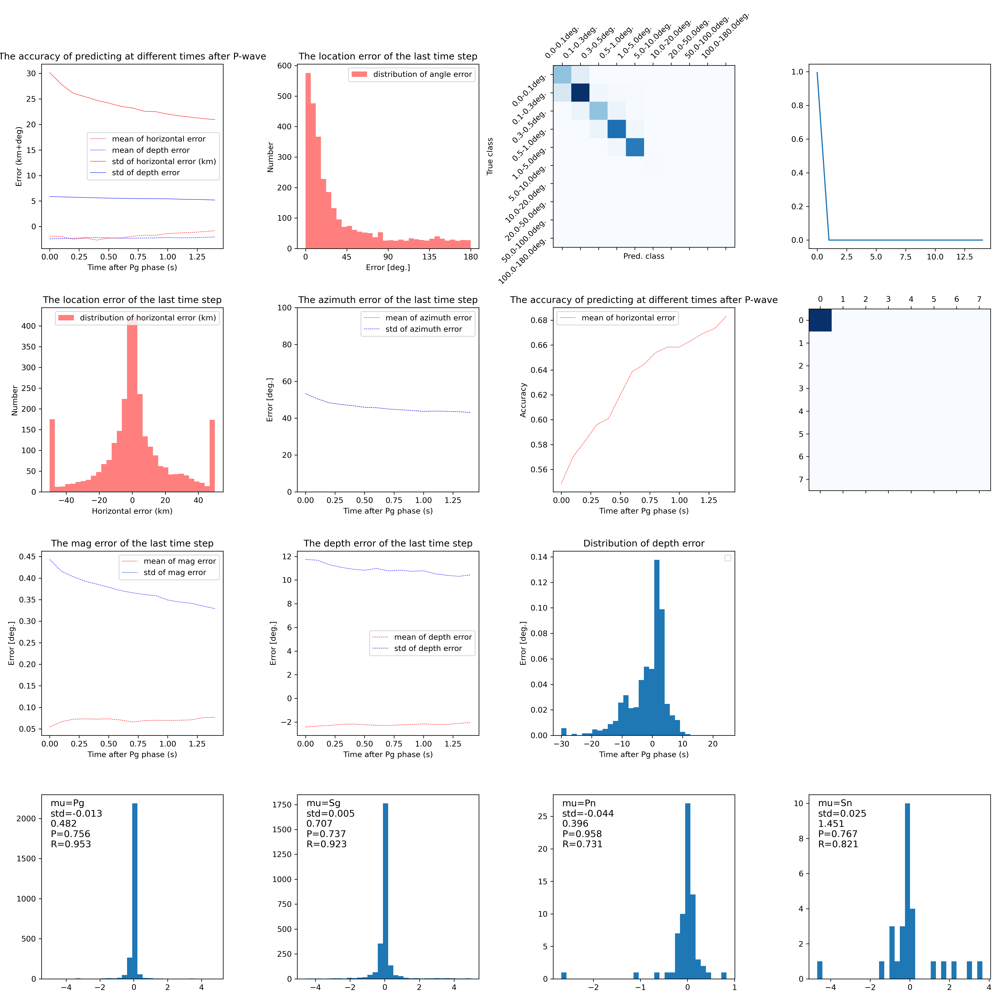

# 生成式单向模型使用说明
模型使用RoPE进行位置编码，数据预处理可以进行流式处理，即每次仅输入20个采样点，不需要输入更多的数据。这带来了两个优势：
1. 推理长度可以无穷大，而且是实时的（延迟3秒输出震相），并且由于训练长度更长，输出的错误概率更低。
2. 可以输出多种信息包括方位角等。
3. 因为使用因果Transformer模型（基于LLaMA），不需要输入当前时刻之后的信息，是真实时推理。
4. 理论上支持无限长数据，但是训练过程中位置编码为0～86400秒，因此86400秒外推精度可能会下降。
5. 任务：
    1. Pg/Sg/Pn/Sg震相检测
    2. 单台反方位角估计（45度误差）
    3. 单台震中距估计（0～2000km，后续全球）
    4. 单台震级估计（-1～8.0）
    5. 单台震源深度估计
    6. 迁移学习加入
        1. 更多震相
        2. 频散拾取
        3. 误差估计


图1. 流式处理示意

## 1. 处理流程
### 1.1 流式推理
流式处理不需要对数据进行全局归一化，因此每次仅需要输入固定长度0.2秒波形即可，同时为了处理多个台支持BATCH输入，最大BATCHSIZE为100。可以修改后重新输出。
```python 
    for t in range(L):#模拟实时推理
        wave_st = wave[:, t*stride:t*stride+stride*2, :]#[:, 0:6]  # 取出每次处理的20采样点三（六）分量波形数据，不需要归一化。
        o_phase_st, o_dist_class_st, o_dist_km_st, o_dist_baz_st, o_mag_st, o_etype_st = model(wave_st)# 0.2秒时间窗预测结果。
        
        o_phase_st = o_phase_st.cpu().numpy()  # 转换为numpy数组
        o_dist_class_st = o_dist_class_st.cpu().numpy()
        o_dist_km_st = o_dist_km_st.cpu().numpy() 
        o_dist_baz_st = o_dist_baz_st.cpu().numpy() 
        o_mag_st = o_mag_st.cpu().numpy() 
        o_etype_st = o_etype_st.cpu().numpy()
        o_phase.append(o_phase_st)
        for b in range(B):
            heaps = batch_heaps[b] 
            for ptype_idx, pname in enumerate(pnames):# 不同震相检测
                phase_list = heaps[ptype_idx]
                if len(phase_list)!=0:
                    pb, pidx, ptype, infos = phase_list[-1]
                else:
                    pb = 0.0
                    pidx = -1 
                    ptype = -1 
                phase_prob = o_phase_st[b, :, ptype_idx+1]
                max_idx = phase_prob.argmax()
                max_idx_stride = max_idx // stride
                max_prob = phase_prob[max_idx] 
                p_time_idx = t * stride + max_idx - 300# 延迟300采样点输出震相概率
                if max_prob > min_prob:# 如果阈值满足，则输出震相概率
                    #print("SELX", p_time_idx)
                    dclass = o_dist_class_st[b, max_idx_stride, :]
                    dclass_idx = dclass.argmax() 
                    dclass_prob = dclass[dclass_idx] 
                    drange = [class_level[dclass_idx], class_level[dclass_idx+1]]
                    dist_regress = o_dist_km_st[b, max_idx_stride, :]
                    if dist_regress[0] < 300:#小于200km输出km
                        dist_km = dist_regress[0]
                        dep_km = dist_regress[1]
                    else:#大于200km时候是度
                        dist_km = degrees2kilometers(dist_regress[0]-300)  # 转换为公里
                        dep_km = dist_regress[1] 
                    baz = o_dist_baz_st[b, max_idx_stride, :]
                    mag = o_mag_st[b, max_idx_stride, 0]
                    detype = o_etype_st[b, max_idx_stride, :]
                    detype_idx = detype.argmax()
                    detype_name = etype_dict[detype_idx]
                    detype_prob = detype[detype_idx]
                    if abs(p_time_idx - pidx) < min_dist:
                        if max_prob > pb:
                            if len(phase_list) > 0:phase_list.pop()
                            phase_list.append([max_prob, p_time_idx, ptype_idx, 
                                           {
                            "dist_range":[drange, dclass_prob],# 震中位置估计
                            "dist_km":dist_km, # 震中距预测，全球范围（目前仅支持2000km）
                            "dep_km":dep_km,   # 地震深度估计
                            "baz_vec":baz,     # 反方位角估计
                            "mag":mag,         # 震级估计
                            "etype":[detype_name, detype_prob]# 地震类型
                        }])
                    else:
                        phase_list.append([max_prob, p_time_idx, ptype_idx, 
                                           {
                            "dist_range":[drange, dclass_prob],# 震中位置估计
                            "dist_km":dist_km, # 震中距预测，全球范围（目前仅支持2000km）
                            "dep_km":dep_km,   # 地震深度估计
                            "baz_vec":baz,     # 反方位角估计
                            "mag":mag,         # 震级估计
                            "etype":[detype_name, detype_prob]# 地震类型
                        }])
```

### 1.2 输出信息
多信息输出：
```python
{'phase_name': 'Pg', 'phase_prob': 0.8425927, 'phase_time': 904, 'dist_range': [[0.0, 11.119492664455874], 0.957908], 'dist_km': 7.50306, 'dep_km': 8.649647, 'baz_vec': [0.50359136, -0.3687521], 'mag': 0.5591611, 'etype': ['eq', 0.9991352]}
{'phase_name': 'Pg', 'phase_prob': 0.6600186, 'phase_time': 10904, 'dist_range': [[0.0, 11.119492664455874], 0.94256395], 'dist_km': 8.492444, 'dep_km': 8.276154, 'baz_vec': [0.52290845, -0.6784278], 'mag': 0.55360955, 'etype': ['eq', 0.99941397]}
{'phase_name': 'Sg', 'phase_prob': 0.8044824, 'phase_time': 1050, 'dist_range': [[0.0, 11.119492664455874], 0.97419995], 'dist_km': 6.450444, 'dep_km': 7.523668, 'baz_vec': [0.5586288, -0.6786208], 'mag': 0.5357085, 'etype': ['eq', 0.99937797]}
{'phase_name': 'Sg', 'phase_prob': 0.5751234, 'phase_time': 11049, 'dist_range': [[0.0, 11.119492664455874], 0.9674457], 'dist_km': 6.9499903, 'dep_km': 6.82007, 'baz_vec': [0.5333796, -0.736281], 'mag': 0.46695274, 'etype': ['eq', 0.9990243]}
```


## 2. 精度测试
### 2.1 全部数据
Pg/Sg震相精度高的高出10%,Pn/Sn震相精度高出30%，方位角估计误差标准差为45°，如图所示：

图2. 精度测试全部数据


### 2.2 高信噪比
高信噪比使用5dB以上的数据进行测试，方位角估计误差变大。Pg/Sg查全率提升到接近100%，准确率也随之下降。
图后续上传
图2. 精度测试高信噪比数据


## 3. 微调
PEFT使用LoRA进行微调，需要的可训练参数更少，约5%参数需要调整用于其他工作。


## 4. 训练数据集
训练使用CSNCD09-19年数据进行训练，测试使用20-22年数据进行测试。

## 5. 联系方式
邮箱：cangye@hotmail.com

## 6. 许可
[GPLv3](https://github.com/cangye/CSNCD09/blob/main/LICENSE)